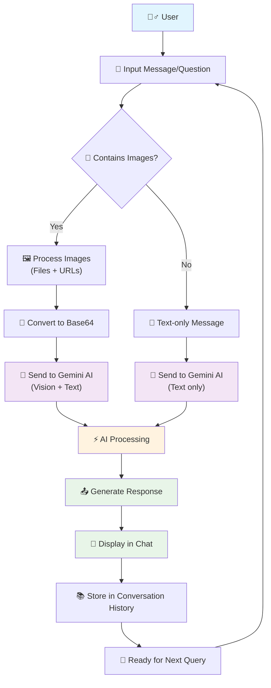

# 🤖 QA Agent - Intelligent Question & Answer Assistant

[](https://reactjs.org/)
[](https://www.typescriptlang.org/)
[](https://vitejs.dev/)
[](https://tailwindcss.com/)
[](https://gemini.google.com/)

> 🚀 A modern, intelligent Q&A chatbot powered by Google's Gemini 1.5 Flash AI model, featuring advanced image analysis capabilities and a beautiful, responsive interface.

## ✨ Features

### 🧠 **AI-Powered Intelligence**
- 💬 Natural language conversation with Google Gemini 1.5 Flash
- 🧠 Context-aware responses that remember conversation history
- 🔄 Seamless conversation flow with intelligent context retention

### 🖼️ **Advanced Image Analysis**
- 📤 **Multiple Image Input Methods:**
  - 🖱️ Drag & drop image files
  - 📎 File upload with preview
  - 🔗 Direct image URL input
  - 📋 Auto-detection of image URLs in messages
- 🎯 **Intelligent Image Processing:**
  - 📸 Support for JPG, PNG, GIF, WebP, and SVG formats
  - 📏 20MB file size limit per image
  - 🔄 Automatic base64 conversion for AI processing
  - 👁️ Real-time image preview before sending

### 🎨 **Beautiful User Interface**
- 🌙 Modern dark theme with sleek design
- 📱 Fully responsive layout (mobile-first approach)
- 🎭 Smooth animations and transitions
- 📋 Collapsible sidebar for chat history
- ⌨️ Auto-resizing text input
- 🎯 Intuitive drag-and-drop interface

### 🔧 **Developer Experience**
- ⚡ Lightning-fast development with Vite
- 🎨 Styled with Tailwind CSS and Shadcn/ui components
- 📝 Full TypeScript support for type safety
- 🧪 Modern React 18 with hooks
- 📦 Optimized build and deployment

## 🛠️ Tech Stack

| Technology | Purpose | Version |
|------------|---------|---------|
| ⚛️ **React** | Frontend Framework | 18.3.1 |
| 📘 **TypeScript** | Type Safety | 5.5.3 |
| ⚡ **Vite** | Build Tool | 5.4.1 |
| 🎨 **Tailwind CSS** | Styling | 3.4.11 |
| 🧩 **Shadcn/ui** | UI Components | Latest |
| 🤖 **Google Gemini AI** | AI Model | 1.5 Flash |
| 🔍 **Lucide React** | Icons | 0.462.0 |
| 🌐 **React Router** | Navigation | 6.26.2 |

## 📋 Prerequisites

Before you begin, ensure you have the following installed:

- 📦 **Node.js** (version 18.0 or higher)
- 🧶 **npm** or **yarn** package manager
- 🔑 **Google Gemini API Key** ([Get one here](https://makersuite.google.com/app/apikey))

## 🚀 Quick Start

### 1️⃣ Clone the Repository
```bash
git clone https://github.com/your-username/qa-agent.git
cd qa-agent
```

### 2️⃣ Install Dependencies
```bash
npm install
# or
yarn install
```

### 3️⃣ Environment Setup
Create a `.env` file in the root directory:
```env
VITE_GEMINI_API_KEY=your_gemini_api_key_here
```

> 💡 **Tip:** Get your free Gemini API key from [Google AI Studio](https://makersuite.google.com/app/apikey)

### 4️⃣ Start Development Server
```bash
npm run dev
# or
yarn dev
```

🎉 **That's it!** Open [http://localhost:5173](http://localhost:5173) in your browser.

## 🔄 Application Workflow



## 🎯 Usage Examples

### 💬 **Text Conversations**
```
User: "What is machine learning?"
AI: "Machine learning is a subset of artificial intelligence..."
```

### 🖼️ **Image Analysis**
```
User: [Uploads photo of a sunset] "Describe this image"
AI: "This is a beautiful sunset scene showing golden hour lighting..."
```

### 🔗 **URL-based Images**
```
User: "Analyze this image: https://example.com/image.jpg"
AI: "I can see in this image that..."
```

## 📁 Project Structure

```
qa-agent/
├── 📂 public/              # Static assets
├── 📂 src/
│   ├── 📂 components/      # React components
│   │   ├── 🧩 ui/         # Shadcn/ui components
│   │   ├── 💬 ChatInterface.tsx
│   │   ├── 📨 ChatMessage.tsx
│   │   ├── 📤 FileUpload.tsx
│   │   └── 🖼️ ImagePreview.tsx
│   ├── 📂 services/        # API services
│   │   └── 🤖 geminiService.ts
│   ├── 📂 hooks/          # Custom React hooks
│   ├── 📂 lib/            # Utilities
│   └── 📂 pages/          # Page components
├── 📄 package.json        # Dependencies
├── ⚙️ vite.config.ts      # Vite configuration
└── 🎨 tailwind.config.ts  # Tailwind configuration
```

## 🔧 Available Scripts

| Command | Description |
|---------|-------------|
| `npm run dev` | 🚀 Start development server |
| `npm run build` | 🏗️ Build for production |
| `npm run preview` | 👀 Preview production build |
| `npm run lint` | 🔍 Run ESLint |

## 🌟 Key Features Explained

### 🤖 **AI Integration**
- **Context Awareness**: Maintains full conversation history for coherent responses
- **Multi-modal Support**: Handles both text and image inputs seamlessly
- **Error Handling**: Graceful fallbacks and user-friendly error messages

### 🖼️ **Image Processing**
- **File Upload**: Drag-and-drop or click to upload images
- **URL Support**: Direct image URL input with validation
- **Format Support**: JPG, PNG, GIF, WebP, SVG
- **Size Optimization**: Automatic compression and validation

### 🎨 **User Experience**
- **Responsive Design**: Works perfectly on desktop, tablet, and mobile
- **Real-time Feedback**: Loading states and typing indicators
- **Accessibility**: ARIA labels and keyboard navigation
- **Performance**: Optimized rendering and lazy loading

## 🔒 Security & Privacy

- 🔐 API keys are stored securely in environment variables
- 🛡️ No image data is stored permanently
- 🚫 No conversation history is saved to external servers
- ✅ Client-side processing for maximum privacy

## 🤝 Contributing

We welcome contributions! Here's how you can help:

1. 🍴 Fork the repository
2. 🌟 Create a feature branch (`git checkout -b feature/amazing-feature`)
3. 💾 Commit your changes (`git commit -m 'Add amazing feature'`)
4. 📤 Push to the branch (`git push origin feature/amazing-feature`)
5. 🎯 Open a Pull Request

## 📝 License

This project is licensed under the MIT License - see the [LICENSE](LICENSE) file for details.

## 🙏 Acknowledgments

- 🤖 **Google Gemini AI** - For the powerful AI capabilities
- 🎨 **Shadcn/ui** - For the beautiful UI components
- ⚡ **Vite Team** - For the blazing fast build tool
- 🎯 **React Team** - For the amazing framework

## 📞 Support

Having issues? We're here to help!

- 🐛 [Report a Bug](https://github.com/your-username/qa-agent/issues)
- 💡 [Request a Feature](https://github.com/your-username/qa-agent/issues)
- 📧 [Contact Support](mailto:support@yourproject.com)

---

<div align="center">

### 🌟 **Made with ❤️ and modern web technologies** 🌟

*Give this project a ⭐ if you found it helpful!*

</div>
